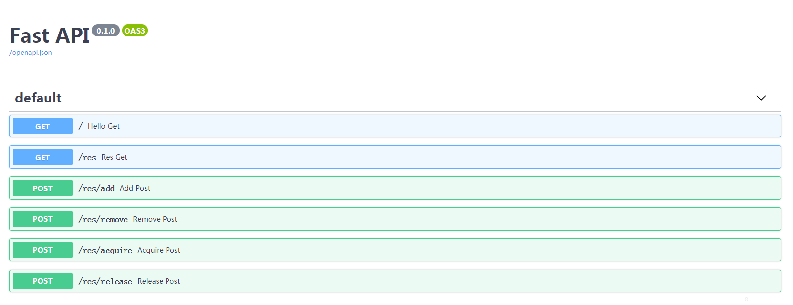

# glockr

[](https://www.python.org/downloads/release/python-360/)
[](https://badge.fury.io/py/glockr)
[](https://codeclimate.com/github/williamfzc/glockr/maintainability)

global lockable resources for all

## goal

Resources lock for everything.

Highly inspired by [Jenkins's lockable resources plugin](https://wiki.jenkins.io/display/JENKINS/Lockable+Resources+Plugin).

And, make it works locally.

## usage

Python 3.6+

### Backend

Start your backend firstly:

```bash
pip install glockr

# default use port 29410
glockrs start
```

Or, directly use docker:

```bash
docker pull williamfzc/glockr
docker run --rm -p 29410:29410 williamfzc/glockr
```

Based on [FastAPI](https://github.com/tiangolo/fastapi), All the API of glockr can be easily viewed and executed via [http://127.0.0.1:29410/docs](http://127.0.0.1:29410/docs). 



You can also use it as UI to manage your resource directly.

### CLI

Make sure glockr backend has been started.

```bash
glockrc heartbeat
```

And you will see the help:

```bash
➜  glockr git:(master) glockrc
Type:        GClient
String form: <glockr.client.GClient object at 0x7f506abcee48>

Usage:       glockrc 
             glockrc acquire-label
             glockrc acquire-name
             glockrc add
             glockrc heartbeat
             glockrc release-label
             glockrc release-name
             glockrc remove
             glockrc show-all
```

New a resource object, named '123', label 'abc':

```bash
in:
glockrc add 123 abc

out:
{'result': True, 'reason': ''}
```

Acquire it by name!

```bash
in:
glockrc acquire-name 123

out:
{'result': True, 'reason': ''}
```

After acquirement, resource has been locked!

```bash
in:
glockrc acquire-name 123

out:
{'result': False, 'reason': 'res 123 status: BUSY'}
```

Label can be used to require locks on multiple resources concurrently.

New a resource object, named '456', label 'abc'. Then, lock label 'abc'. By doing this, '123' and '456' (because they have label 'abc') will be locked.

```bash
in:
glockrc release-name 123
glockrc add 456 abc
glockrc acquire-label abc
glockrc show-all

out:
{'123': {'name': '123', 'label': 'abc', 'status': 'BUSY'}, '456': {'name': '456', 'label': 'abc', 'status': 'BUSY'}}
```

JSON response can be easily handled by other programs.

### program (WIP)

Based on C/S, glockr supports different language clients.
